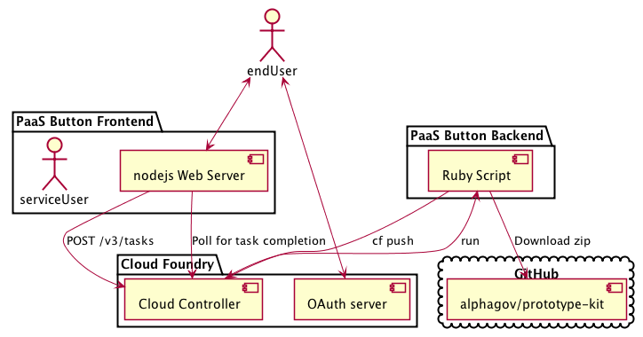

PaaS Button
===========

Deploy to the PaaS using a beautiful button like this:

:tada: :tada: :tada:
:tada: :tada: :tada:
:tada: :tada: :tada:

Architecture
------------

The PaaS Button is composed of a frontend web server and a backend task.

The frontend serves the button itself and a web user interface which allows the
user to sign in and configure the app they're deploying.

The backend is currently a little ruby script that downloads the requested GitHub
repo, unzips it, and then runs `cf push` to deploy it.

The frontend doesn't communicate directly with the backend - instead it uses
[Cloud Foundry tasks](https://docs.cloudfoundry.org/devguide/using-tasks.html) to
perform the deployment.

To trigger a backend task there's a bit of credential shuffling that needs to
happen - the frontend needs credentials that give it permission to run the task
in the backend and the backend needs the end user's credentials so it can push
their app.

This is handled by getting the end user to sign in with Cloud Foundry's OAuth
server (UAA) and having a service user whose credentials are stored in an
environment variable on the frontend.

(see [docs/architecture.org](docs/architecture.org))

The current backend implementation uses the `cf` command line interface to
interact with Cloud Foundry. Sadly the CLI wasn't really built for this use case,
so the backend has to hack around with the CLI's config file before it will work.

TODO
----

* [x] Add tests
* [x] Make the user log in before they can deploy their app
* [x] Come up with a strawman design
* [x] Build a simple backend (shell out to `cf push` initially?)
* [x] Stop hardcoding path-to-zip
* [x] Logout link
* [x] Form validation
* [x] Stop hardcoding app name and route
* [x] Handle errors properly
* [x] Fork the prototype kit so it can be used for demos
* [x] Make the prototype kit link to edit pages on github
* [x] Handle any other TODOs you can find
* [x] Do some user research
* [ ] CSRF protection
* [ ] Handle org and space properly
* [ ] Stream logs
* [ ] Iterate your way to bliss

